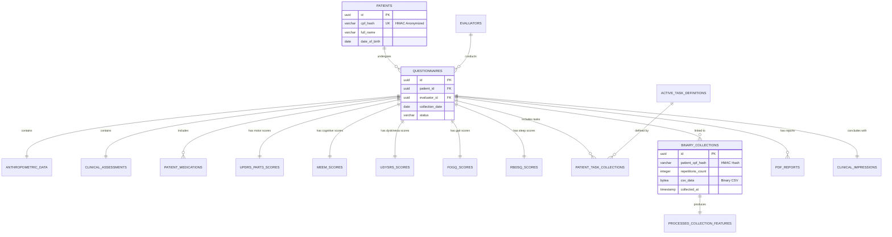
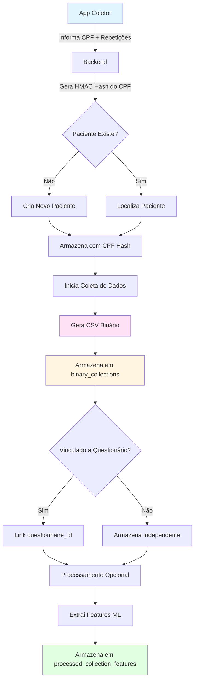

# Database Entity Relationship Diagram

## Parkinson's Disease Clinical Assessment System

Este diagrama representa o modelo de banco de dados normalizado para o sistema de avaliação clínica de pacientes com Doença de Parkinson.

### Características Principais:
- **Anonimização de Dados**: CPF armazenado como hash HMAC para conformidade com LGPD/HIPAA
- **Normalização 3NF**: Eliminação de redundâncias e dependências transitivas
- **Armazenamento de Binários**: Suporte para arquivos CSV de coletas com sensores
- **Auditoria Completa**: Registro de todas operações críticas
- **Integridade Referencial**: Chaves estrangeiras com cascata apropriada

---

## Diagrama ER - Visão Completa

```mermaid
erDiagram
    %% ========================================
    %% DOMAIN TABLES (Reference Data)
    %% ========================================

    gender_types {
        serial id PK
        varchar code UK
        varchar description
        boolean active
    }

    ethnicity_types {
        serial id PK
        varchar code UK
        varchar description
        boolean active
    }

    education_levels {
        serial id PK
        varchar code UK
        varchar description
        integer years_equivalent
        boolean active
    }

    marital_status_types {
        serial id PK
        varchar code UK
        varchar description
        boolean active
    }

    income_ranges {
        serial id PK
        varchar code UK
        varchar description
        decimal min_salary
        decimal max_salary
        boolean active
    }

    parkinson_phenotypes {
        serial id PK
        varchar code UK
        varchar description
        boolean active
    }

    hoehn_yahr_scale {
        serial id PK
        decimal stage UK
        text description
    }

    dyskinesia_types {
        serial id PK
        varchar code UK
        varchar description
    }

    medications_reference {
        serial id PK
        varchar drug_name UK
        varchar generic_name
        decimal led_conversion_factor
        varchar medication_class
        boolean active
        text notes
    }

    surgery_types {
        serial id PK
        varchar code UK
        varchar description
        boolean active
    }

    collection_form_types {
        serial id PK
        varchar code UK
        varchar description
    }

    %% ========================================
    %% CORE ENTITY TABLES
    %% ========================================

    evaluators {
        uuid id PK
        varchar full_name
        varchar registration_number UK
        varchar specialty
        varchar email UK
        varchar phone
        boolean active
        timestamp created_at
        timestamp updated_at
    }

    patients {
        uuid id PK
        varchar cpf_hash UK "HMAC Hash for anonymization"
        varchar full_name
        date date_of_birth
        integer gender_id FK
        integer ethnicity_id FK
        varchar nationality
        varchar email
        varchar phone_primary
        varchar phone_secondary
        integer education_level_id FK
        varchar education_other
        integer marital_status_id FK
        varchar occupation
        integer income_range_id FK
        boolean is_current_smoker
        integer smoking_duration_years
        integer years_since_quit_smoking
        boolean active
        timestamp created_at
        timestamp updated_at
    }

    questionnaires {
        uuid id PK
        uuid patient_id FK
        uuid evaluator_id FK
        date collection_date
        varchar assessment_version
        varchar status
        timestamp created_at
        timestamp updated_at
        timestamp completed_at
    }

    %% ========================================
    %% CLINICAL DATA TABLES
    %% ========================================

    anthropometric_data {
        uuid id PK
        uuid questionnaire_id FK UK
        decimal weight_kg
        decimal height_cm
        decimal bmi "GENERATED"
        decimal waist_circumference_cm
        decimal hip_circumference_cm
        decimal abdominal_circumference_cm
        decimal waist_hip_ratio "GENERATED"
        timestamp created_at
    }

    clinical_assessments {
        uuid id PK
        uuid questionnaire_id FK UK
        text diagnostic_description
        integer age_at_onset
        varchar initial_symptom
        varchar affected_side
        integer phenotype_id FK
        integer hoehn_yahr_stage_id FK
        integer schwab_england_score
        boolean has_family_history
        varchar family_kinship_degree
        boolean has_dyskinesia
        boolean dyskinesia_interfered
        integer dyskinesia_type_id FK
        boolean has_freezing_of_gait
        boolean has_wearing_off
        decimal average_on_time_hours
        boolean has_delayed_on
        decimal ldopa_onset_time_hours
        boolean assessed_on_levodopa
        boolean has_surgery_history
        integer surgery_year
        integer surgery_type_id FK
        varchar surgery_target
        text comorbidities
        text other_medications
        text disease_evolution
        text current_symptoms
        timestamp created_at
        timestamp updated_at
    }

    patient_medications {
        uuid id PK
        uuid questionnaire_id FK
        integer medication_id FK
        decimal dose_mg
        integer doses_per_day
        decimal led_conversion_factor
        decimal led_value "GENERATED"
        timestamp created_at
    }

    %% ========================================
    %% NEUROLOGICAL ASSESSMENT SCALES
    %% ========================================

    updrs_part3_scores {
        uuid id PK
        uuid questionnaire_id FK UK
        smallint speech
        smallint facial_expression
        smallint rigidity_neck
        smallint rigidity_rue
        smallint rigidity_lue
        smallint rigidity_rle
        smallint rigidity_lle
        smallint finger_tapping_right
        smallint finger_tapping_left
        smallint hand_movements_right
        smallint hand_movements_left
        smallint pronation_supination_right
        smallint pronation_supination_left
        smallint toe_tapping_right
        smallint toe_tapping_left
        smallint leg_agility_right
        smallint leg_agility_left
        smallint rising_from_chair
        smallint gait
        smallint freezing_of_gait
        smallint postural_stability
        smallint posture
        smallint global_bradykinesia
        smallint postural_tremor_right
        smallint postural_tremor_left
        smallint kinetic_tremor_right
        smallint kinetic_tremor_left
        smallint rest_tremor_rue
        smallint rest_tremor_lue
        smallint rest_tremor_rle
        smallint rest_tremor_lle
        smallint rest_tremor_lip_jaw
        smallint postural_tremor_amplitude
        boolean dyskinesia_present
        boolean dyskinesia_interfered
        integer total_score "GENERATED"
        timestamp created_at
    }

    meem_scores {
        uuid id PK
        uuid questionnaire_id FK UK
        smallint orientation_day
        smallint orientation_date
        smallint orientation_month
        smallint orientation_year
        smallint orientation_time
        smallint orientation_location
        smallint orientation_institution
        smallint orientation_city
        smallint orientation_state
        smallint orientation_country
        smallint registration_word1
        smallint registration_word2
        smallint registration_word3
        smallint attention_calc1
        smallint attention_calc2
        smallint attention_calc3
        smallint attention_calc4
        smallint attention_calc5
        smallint recall_word1
        smallint recall_word2
        smallint recall_word3
        smallint language_naming1
        smallint language_naming2
        smallint language_repetition
        smallint language_command1
        smallint language_command2
        smallint language_command3
        smallint language_reading
        smallint language_writing
        smallint language_copying
        integer total_score "GENERATED (0-30)"
        timestamp created_at
    }

    udysrs_scores {
        uuid id PK
        uuid questionnaire_id FK UK
        smallint on_dyskinesia_time
        smallint impact_speech
        smallint impact_chewing
        smallint impact_eating
        smallint impact_dressing
        smallint impact_hygiene
        smallint impact_writing
        smallint impact_hobbies
        smallint impact_walking
        smallint impact_social
        smallint impact_emotional
        smallint off_dystonia_time
        smallint dystonia_activities
        smallint dystonia_pain_impact
        smallint dystonia_pain_severity
        smallint severity_face
        smallint severity_neck
        smallint severity_right_arm
        smallint severity_left_arm
        smallint severity_trunk
        smallint severity_right_leg
        smallint severity_left_leg
        smallint disability_communication
        smallint disability_drinking
        smallint disability_dressing
        smallint disability_walking
        integer historical_subscore "GENERATED"
        integer objective_subscore "GENERATED"
        integer total_score "GENERATED"
        timestamp created_at
    }

    nms_scores {
        uuid id PK
        uuid questionnaire_id FK UK
        jsonb cardiovascular_items
        jsonb sleep_items
        jsonb mood_items
        jsonb perceptual_items
        jsonb attention_items
        jsonb gastrointestinal_items
        jsonb urinary_items
        jsonb sexual_items
        jsonb miscellaneous_items
        integer total_score
        timestamp created_at
        timestamp updated_at
    }

    nmf_scores {
        uuid id PK
        uuid questionnaire_id FK UK
        smallint change_depression
        smallint change_anxiety
        smallint change_cognition
        smallint change_urinary
        smallint change_restlessness
        smallint change_pain
        smallint change_fatigue
        smallint change_sweating
        smallint time_rating
        integer total_score "GENERATED"
        timestamp created_at
    }

    fogq_scores {
        uuid id PK
        uuid questionnaire_id FK UK
        smallint gait_worst_state
        smallint impact_daily_activities
        smallint feet_stuck
        smallint longest_episode
        smallint hesitation_initiation
        smallint hesitation_turning
        integer total_score "GENERATED (0-24)"
        timestamp created_at
    }

    stopbang_scores {
        uuid id PK
        uuid questionnaire_id FK UK
        boolean snoring
        boolean tired
        boolean observed_apnea
        boolean blood_pressure
        boolean bmi_over_35
        boolean age_over_50
        boolean neck_circumference_large
        boolean gender_male
        integer total_score "GENERATED (0-8)"
        timestamp created_at
    }

    epworth_scores {
        uuid id PK
        uuid questionnaire_id FK UK
        smallint sitting_reading
        smallint watching_tv
        smallint sitting_inactive_public
        smallint passenger_car
        smallint lying_down_afternoon
        smallint sitting_talking
        smallint sitting_after_lunch
        smallint car_stopped_traffic
        integer total_score "GENERATED (0-24)"
        timestamp created_at
    }

    pdss1_scores {
        uuid id PK
        uuid questionnaire_id FK UK
        smallint q1_sleep_quality
        smallint q2_difficulty_falling_asleep
        smallint q3_difficulty_staying_asleep
        smallint q4_restlessness
        smallint q5_distressing_dreams
        smallint q6_distressing_hallucinations
        smallint q7_nocturia
        smallint q8_difficulty_turning
        smallint q9_painful_posturing
        smallint q10_tremor_waking
        smallint q11_tired_waking
        smallint q12_refreshed_waking
        smallint q13_daytime_dozing
        smallint q14_unexpected_dozing
        smallint q15_total_sleep_hours
        integer total_score "GENERATED (0-150)"
        decimal average_score "GENERATED (0-10)"
        timestamp created_at
    }

    rbdsq_scores {
        uuid id PK
        uuid questionnaire_id FK UK
        boolean q1_vivid_dreams
        boolean q2_aggressive_content
        boolean q3_dream_enactment
        boolean q4_limb_movements
        boolean q5_injury_potential
        boolean q6_bed_disruption
        boolean q7_awakening_recall
        boolean q8_sleep_disruption
        boolean q9_neurological_disorder
        boolean q10_rem_behavior_problem
        integer total_score "GENERATED (0-8)"
        timestamp created_at
    }

    %% ========================================
    %% ACTIVE TASKS / MOTOR COLLECTION
    %% ========================================

    active_task_definitions {
        serial id PK
        varchar task_code UK
        varchar task_name
        varchar task_category
        integer collection_form_type_id FK
        integer stage
        text description
        text instructions
        boolean active
    }

    task_checklist_items {
        serial id PK
        integer task_id FK
        integer item_order
        varchar item_description
    }

    patient_task_collections {
        uuid id PK
        uuid questionnaire_id FK
        integer task_id FK
        decimal completion_percentage
        jsonb completed_items
        timestamp collected_at
        text collector_notes
        timestamp created_at
    }

    %% ========================================
    %% BINARY DATA STORAGE
    %% ========================================

    binary_collections {
        uuid id PK
        varchar patient_cpf_hash "HMAC Hash"
        integer repetitions_count
        integer task_id FK
        uuid questionnaire_id FK
        bytea csv_data "Binary CSV"
        integer file_size_bytes
        varchar file_checksum "SHA-256"
        varchar collection_type
        varchar device_type
        varchar device_serial
        decimal sampling_rate_hz
        timestamp collected_at
        timestamp uploaded_at
        jsonb metadata
        varchar processing_status
        text processing_error
        uuid created_by FK
    }

    processed_collection_features {
        uuid id PK
        uuid binary_collection_id FK UK
        jsonb features
        varchar extraction_algorithm
        varchar algorithm_version
        timestamp extracted_at
        decimal data_quality_score
        decimal completeness_percentage
        timestamp created_at
    }

    %% ========================================
    %% PDF REPORTS
    %% ========================================

    pdf_reports {
        uuid id PK
        uuid questionnaire_id FK
        varchar report_type
        varchar file_path
        bytea file_data
        varchar file_name
        integer file_size_bytes
        varchar mime_type
        uuid uploaded_by FK
        timestamp uploaded_at
        text notes
    }

    %% ========================================
    %% CLINICAL IMPRESSIONS
    %% ========================================

    clinical_impressions {
        uuid id PK
        uuid questionnaire_id FK UK
        text neurological_exam
        text resting_tremor_findings
        text postural_findings
        text levodopa_response
        text agonist_response
        text diagnostic_impression
        text recommended_conduct
        text additional_notes
        timestamp created_at
        timestamp updated_at
    }

    %% ========================================
    %% AUDIT TRAIL
    %% ========================================

    audit_log {
        uuid id PK
        varchar table_name
        uuid record_id
        varchar operation
        uuid user_id FK
        varchar user_role
        jsonb old_values
        jsonb new_values
        timestamp performed_at
        inet ip_address
        text user_agent
        text notes
    }

    %% ========================================
    %% RELATIONSHIPS
    %% ========================================

    %% Patient relationships
    patients ||--o{ gender_types : "has gender"
    patients ||--o{ ethnicity_types : "has ethnicity"
    patients ||--o{ education_levels : "has education level"
    patients ||--o{ marital_status_types : "has marital status"
    patients ||--o{ income_ranges : "has income range"
    patients ||--o{ questionnaires : "undergoes"

    %% Questionnaire relationships
    evaluators ||--o{ questionnaires : "conducts"
    questionnaires ||--|| anthropometric_data : "contains"
    questionnaires ||--|| clinical_assessments : "contains"
    questionnaires ||--o{ patient_medications : "includes"
    questionnaires ||--|| updrs_part3_scores : "has"
    questionnaires ||--|| meem_scores : "has"
    questionnaires ||--|| udysrs_scores : "has"
    questionnaires ||--|| nms_scores : "has"
    questionnaires ||--|| nmf_scores : "has"
    questionnaires ||--|| fogq_scores : "has"
    questionnaires ||--|| stopbang_scores : "has"
    questionnaires ||--|| epworth_scores : "has"
    questionnaires ||--|| pdss1_scores : "has"
    questionnaires ||--|| rbdsq_scores : "has"
    questionnaires ||--o{ patient_task_collections : "includes"
    questionnaires ||--o{ pdf_reports : "has"
    questionnaires ||--|| clinical_impressions : "contains"
    questionnaires ||--o{ binary_collections : "linked to"

    %% Clinical assessment relationships
    clinical_assessments ||--o{ parkinson_phenotypes : "classified as"
    clinical_assessments ||--o{ hoehn_yahr_scale : "staged by"
    clinical_assessments ||--o{ dyskinesia_types : "experiences"
    clinical_assessments ||--o{ surgery_types : "underwent"

    %% Medication relationships
    patient_medications ||--|| medications_reference : "uses"

    %% Task relationships
    active_task_definitions ||--o{ collection_form_types : "uses form type"
    active_task_definitions ||--o{ task_checklist_items : "contains"
    active_task_definitions ||--o{ patient_task_collections : "collected as"
    active_task_definitions ||--o{ binary_collections : "generates"

    %% Binary collection relationships
    binary_collections ||--|| processed_collection_features : "produces"
    binary_collections ||--o{ evaluators : "uploaded by"

    %% PDF report relationships
    pdf_reports ||--o{ evaluators : "uploaded by"

    %% Audit relationships
    audit_log ||--o{ evaluators : "performed by"
```

---

## Diagrama Simplificado - Entidades Principais



---

## Fluxo de Dados - Coleta com App Coletor



---

## Normalização do Banco de Dados

### Primeira Forma Normal (1NF)
- ✅ Todos os atributos contêm apenas valores atômicos
- ✅ Não há grupos repetitivos (arrays de medicamentos movidos para tabela separada)
- ✅ Cada tabela tem chave primária definida

### Segunda Forma Normal (2NF)
- ✅ Está em 1NF
- ✅ Todos os atributos não-chave dependem da chave primária completa
- ✅ Tabelas de referência separadas (gender_types, medications_reference, etc.)

### Terceira Forma Normal (3NF)
- ✅ Está em 2NF
- ✅ Não há dependências transitivas
- ✅ Scores calculados usam GENERATED columns (não armazenados redundantemente)
- ✅ Dados de referência normalizados em tabelas separadas

---

## Índices Principais

### Performance Otimizada
- **Busca por CPF Anonimizado**: `idx_patients_cpf_hash`, `idx_binary_cpf_hash`
- **Consultas Temporais**: `idx_questionnaires_date`, `idx_binary_collected_at`
- **Relacionamentos**: Índices em todas as chaves estrangeiras
- **Auditoria**: `idx_audit_performed`, `idx_audit_table`

### Segurança e Privacidade
- CPF armazenado apenas como **HMAC hash** (SHA-256)
- Backend responsável por gerar hash antes de inserção
- Impossível recuperar CPF original do hash
- Conformidade com LGPD e HIPAA

---

## Views Principais

### v_patient_summary
Resumo completo do paciente com total de avaliações e última data de coleta.

### v_questionnaire_summary
Visão consolidada de um questionário com todos os scores calculados e informações do paciente.

### v_binary_collections_summary
Lista todas as coletas binárias com informações do paciente, tarefa associada e status de processamento.

---

## Triggers de Auditoria

### Tabelas Auditadas Automaticamente
- `patients` - Criação, modificação e exclusão de pacientes
- `questionnaires` - Todas as operações em avaliações
- `binary_collections` - Rastreamento de uploads e processamento

### Informações Capturadas
- Valores anteriores (UPDATE/DELETE)
- Valores novos (INSERT/UPDATE)
- Timestamp da operação
- Usuário responsável (evaluator_id)
- Tipo de operação (INSERT/UPDATE/DELETE)

---

## Exemplo de Uso - Coleta com App

```sql
-- 1. Backend recebe CPF do app coletor e gera hash HMAC
-- Hash gerado: 'a3f2b8c9d1e4f5...' (exemplo)

-- 2. Insere coleta binária com hash do CPF
INSERT INTO binary_collections (
    patient_cpf_hash,
    repetitions_count,
    csv_data,
    file_size_bytes,
    file_checksum,
    collection_type,
    device_type,
    collected_at
) VALUES (
    'a3f2b8c9d1e4f5...',  -- Hash HMAC do CPF
    10,                     -- 10 repetições
    decode('89504e470d0a1a0a...', 'hex'),  -- Dados binários
    2048576,
    'sha256checksum...',
    'MOTOR',
    'Biobit Sensor',
    CURRENT_TIMESTAMP
);

-- 3. Consulta coletas de um paciente (usando hash)
SELECT * FROM v_binary_collections_summary
WHERE patient_cpf_hash = 'a3f2b8c9d1e4f5...'
ORDER BY collected_at DESC;
```

---

## Considerações de Segurança

### Anonimização
- CPF nunca armazenado em texto plano
- HMAC com chave secreta mantida fora do banco
- Hash unidirecional (não reversível)

### Backup e Recuperação
- Dados binários podem ser grandes (considerar backup incremental)
- Checksums SHA-256 para verificação de integridade
- Audit log para rastreabilidade completa

### Escalabilidade
- UUIDs permitem distribuição de dados
- Índices otimizados para queries frequentes
- JSONB para flexibilidade sem perder performance
- Views para abstrair complexidade

---

## Tecnologia Utilizada

- **SGBD**: PostgreSQL 12+
- **Extensões**: uuid-ossp, pgcrypto
- **Tipos Especiais**: JSONB, BYTEA, INET
- **Features**: GENERATED columns, triggers, views
- **Constraints**: CHECK, UNIQUE, FOREIGN KEY com CASCADE

---

**Diagrama gerado automaticamente a partir do schema SQL**
*Última atualização: 2025-11-03*
